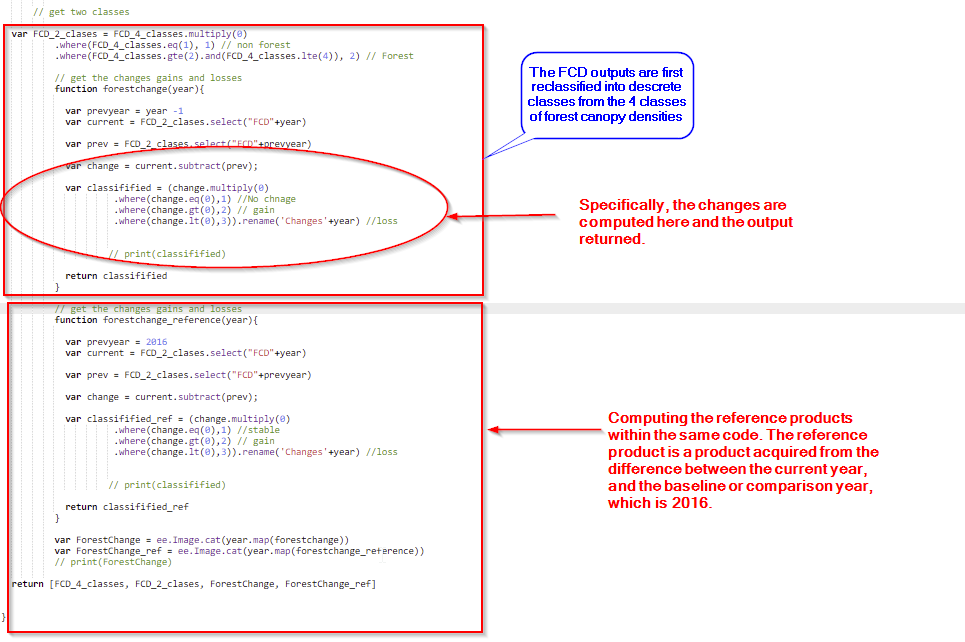

.. figure:: ../_static/Images/trofmis3.png

******************************************************************************************************
WE ARE TRYING TO SEE HOW TO REPORT ON CARBON CHANGES IN THE TROPICAL FOREST
******************************************************************************************************

***************************************************
Forest Carbon Flux (Carbon Emission)
***************************************************
Carbon flux product is generated from the Reference product computed from the difference between the comparison period (2016) and consequent years (2017, 2018, 2019, 2020).

The referenced products are first classified into two classes (Forest and Non Forest areas).
The classified products are then used to compute the difference between the analysis period and the comparison period.
The assumption made, is that the forest monitored is an instant forest, and any change in class depicts either carbon emitted or carbon enhanced.

The resultant Carbon flux product, provides information on estimated carbon transferred from the above ground pool to the atmosphere, or the vice versa (sequestration) when afforestation/reforestation or regrowth occurs.
To estimate the carbon stocks, the above ground biomass (AGB) stocks in the Tropical Forests of the Eastern Africa region, are estimated based on the 2006 IPCC guidelines.
For Tropical rain forests, the AGB is estimated at 310 Mg Biomass/ha, which is converted to 145.7 Mg Carbon/ha and translated to 534 Mg CO2 eq/ha 
(CO2 is carbon dioxide). 
Based on the above emission factors, and the deforested forest areas (Activity Data), between two time intervals, Emission estimates (E) is estimated as shown in the formula below.

.. math::
 E = AD*EF	 
 :label: Carbon Emission Equation

With AD being the change of forest cover in hectares (Deforestation - AD) and the reference value of 
carbon stock density per hectare in tropical forests (EF – Reference Value (Integer)).

The carbon flux was computed from the binary class of forest and non-forest class, where the difference between the Analysis period, and the reference year 2016 was generated, as is shown in the table below.

+------------------+-----------+---------+---------------+
| Sensor/Dataset   | Min       | Max     |               |  
+==================+===========+=========+===============+
| Non Forest       | 0         | 30      |  Non Forest   |  
+------------------+-----------+---------+---------------+
| Open Canopy      | 30        | 45      |               |  
+------------------+-----------+---------+   Forest      +
| Moderate Canopy  | 45        | 65      |               |  
+------------------+-----------+---------+               +
| Dense Canopy     | 65        | 100     |               |  
+------------------+-----------+---------+---------------+

To compute the carbon flux, please consider the steps as illsutrated below.

* Surpose you get the pixel count as above, go ahead and calculate the net changes

+------------------+-----------+
| Class            |Pixel Count|  
+==================+===========+
| Stable           | 11143909  | 
+------------------+-----------+
| Loss             |391764     |
+------------------+-----------+
| Gain             | 173370    |
+------------------+-----------+

 .. code-block:: bash
							
		Compute the net change.							

		Net Changes	Gain - Loss

		(173370 subtract 391764)

		Net Change	173370					

		After Getting the net change, some conditions have to be met							

		   * If the change is positive (+), then there was carbon enhancement						
		   * If the change is negative (-), then there is carbon loss						
		   * Get the carbon flux (emmission) by first transforming the Net Change to hectares, and then multiply by 145.7 Mg C/ha							

		Net Change (Ha)	1722.7					

		   - Carbon Emmission	250997.39	Mg C/ha	per year	

		

The carbon flux statistics are generated as shown in the illustrated steps above, different from the other products which are based on pixel counts in hectares.
Please refer to the code as is shown below.

 .. code-block:: bash

                 var FCD_2_clases = FCD_4_classes.multiply(0)
                            .where(FCD_4_classes.eq(1), 1) // non forest 
                            .where(FCD_4_classes.gte(2).and(FCD_4_classes.lte(4)), 2) // Forest 

                            //Get the changes gains and losses
                            function forest change(year){

                              var prevyear = year -1 
                              var current = FCD_2_clases.select("FCD"+year)

                              var prev = FCD_2_clases.select("FCD"+prevyear)

                              var change = current.subtract(prev);

                              var classifified = (change.multiply(0) 
                                       .where(change.eq(0),1) //No chnage 
                                       .where(change.gt(0),2) // gain
                                       .where(change.lt(0),3)).rename('Changes'+year) //loss

                                      // print(classifified)

                              return classifified
                            }

                            // get the changes gains and losses
                            function forestchange_reference(year){

                              var prevyear = 2016 
                              var current = FCD_2_clases.select("FCD"+year)

                              var prev = FCD_2_clases.select("FCD"+prevyear)

                              var change = current.subtract(prev);

                              var classifified_ref = (change.multiply(0) 
                                       .where(change.eq(0),1) //stable 
                                       .where(change.gt(0),2) // gain
                                       .where(change.lt(0),3)).rename('Changes'+year) //loss

                                      // print(classifified)

                              return classifified_ref
                            }

                            var ForestChange = ee.Image.cat(year.map(forestchange))
                            var ForestChange_ref = ee.Image.cat(year.map(forestchange_reference))
                            // print(ForestChange)

                    return [FCD_4_classes, FCD_2_clases, ForestChange, ForestChange_ref]

 Just like the FCD products, the carbon flux products are exported in drive, and the finall geotiff files will require mosaicking.
 The Forest Change products come as a multiband raster, and will also be loaded as a multi band raster in the database.
 The use of R code is also employed in mosaicking the multiband rasters and saving them in a folder before updating in the database.
 
 .. code-block:: bash
 
 
            library(raster)
            library(sp)
            library(ggplot2)

                  setwd("H:/1.FORESTT/Sentinel_2/mosaic")
                  getwd()

                  year<-"2019"
                  country<-"Uganda"
                  fn<- paste('FCD_',country,year,'Sentinel_2_mos.tif',sep="")

                  my_dirs<- paste("G:/My Drive/TROFMIS_UgandaSentinel_changes",year, sep="") 

                  all_text_files <- list.files(my_dirs, pattern = "\\.tif$", full.names = TRUE)

                  print(length(all_text_files))

                  for (file in all_text_files){

                    print(file)
                  }

                  print(length(all_text_files))

                  r1<-stack(all_text_files[1])
                  r2<-stack(all_text_files[2])
                  r3<-stack(all_text_files[3])
                  r4<-stack(all_text_files[4])
                  r5<-stack(all_text_files[5])
                  r6<-stack(all_text_files[6])
                  print(r19)

                  rmoz<- mosaic(r1,r2,r3,r4,r5,r6
                                ,fun = mean, tolerance=0.05, filename = 'reference_product.tif') 
                  plot(rmoz)

 
 To use R in mosaicking, it is vital that the working directory is set prior to computation. This is to allow the files to be read and writtenly seamlessly, 
 as well as to avoid errors that might arise.
 
Carbon Flux Encoding
======================================================== 
Carbon Flux is a multi band raster, whereby, each product has 3 bands encorded as follows.

+------------------+-----------+---------+
| Band Value       | Class     | Max     | 
+==================+===========+=========+
| 1                | Stable    |  1      | 
+------------------+-----------+---------+
| 2                | Gain      |  2      | 
+------------------+-----------+---------+
| 3                | Loss      |  3      | 
+------------------+-----------+---------+

 
The Style Layer Descriptor (SLD), can be referenced from the code below.

 .. code-block:: bash

                  <?xml version="1.0" encoding="UTF-8"?>
                              <StyledLayerDescriptor xmlns="http://www.opengis.net/sld" version="1.0.0" 
                              xmlns:sld="http://www.opengis.net/sld" xmlns:gml="http://www.opengis.net/gml"         xmlns:ogc="http://www.opengis.net/ogc">
                                <UserLayer>
                                  <sld:LayerFeatureConstraints>
                                    <sld:FeatureTypeConstraint/>
                                  </sld:LayerFeatureConstraints>
                                  <sld:UserStyle>
                                    <sld:Name> Changes </sld:Name>
                                    <sld:FeatureTypeStyle>
                                    <sld:Rule>
                                      <sld:RasterSymbolizer>
                                        <sld:ChannelSelection>
                                          <sld:GrayChannel>
                                          <sld:SourceChannelName>1</sld:SourceChannelName>
                                          </sld:GrayChannel>
                                        </sld:ChannelSelection>
                                        <sld:ColorMap type="intervals">
                                          <sld:ColorMapEntry label="Stable" quantity="1" color="#549914"/>
                                          <sld:ColorMapEntry label="Gain" quantity="2" color="#45f70a"/>
                                          <sld:ColorMapEntry label="Loss" quantity="3" color="#fa1702"/>
                                        </sld:ColorMap>
                                      </sld:RasterSymbolizer>
                                    </sld:Rule>
                                    </sld:FeatureTypeStyle>
                                  </sld:UserStyle>
                                </UserLayer>
                              </StyledLayerDescriptor>
 
 
 However, the statistics are generated as a time series, of carbon flux change from 2016 - 2020, as can be witnessed in TroFMIS.

    
    
    
.. figure:: ../_static/Images/trofmis3.png  
    
.. toctree::
   :maxdepth: 3
   
