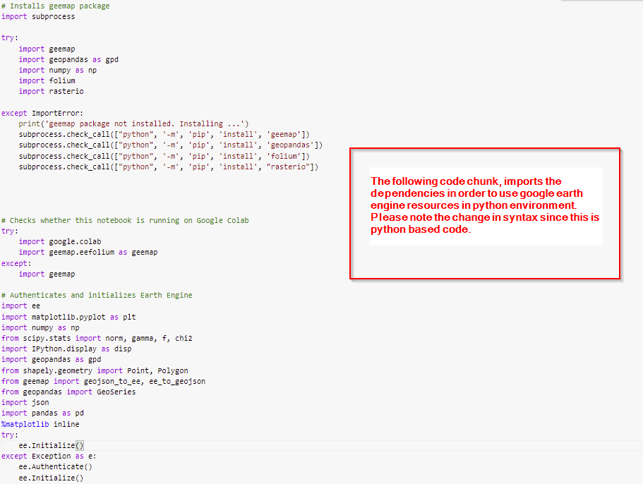
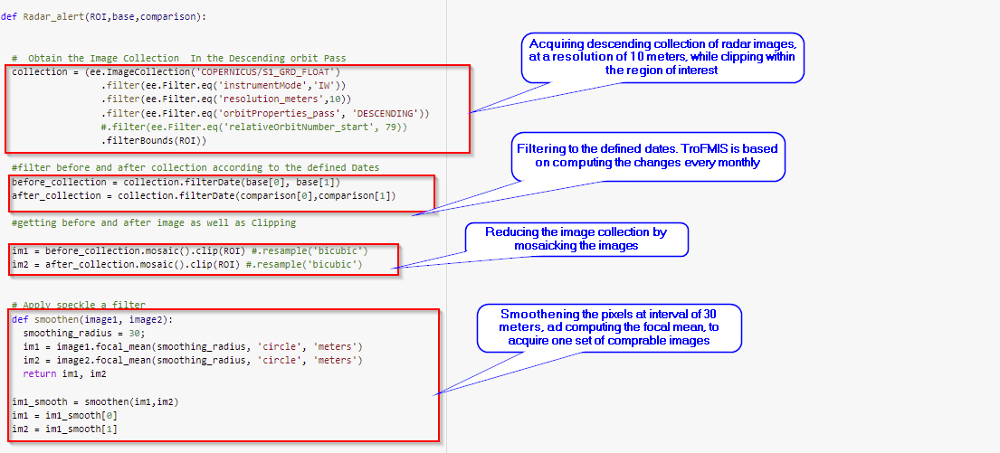
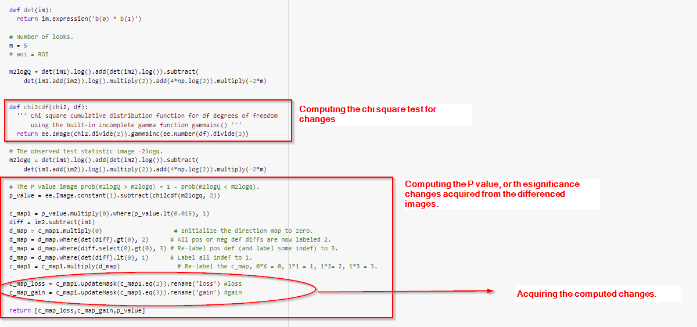

.. figure:: ../_static/Images/trofmis3.png

==========================================================
Forest Disturbance and Surveilance - (Sentinel 1 Radar) 
==========================================================
Forest Disturbance,is mainly associated with forest degradation. It is a systematic process where the forest loses its capacity of acting as carbon sinks among other ecological roles. This is mainly due to continuous extraction of trees and disruption of forest ecosystem Ultimately leading to deforestation. 
Degradation can also be attributed to continuous loss of vegetation of forest quality overtime.
Forest Degradation was analysed through the application of dual approach, including:

	  * Bivariate Radar Based Method.
 	  * Optical Based Method. 
	

Forest Canopy Disturbance Using (Bivariate Radar Method).
==========================================================
Radar images are capable of transcending the cloud cover challenge, an attribute that normally lacks with the optical sensors. 
The canopy disturbance monitoring using Radar images is thus considered superior due to this ability.
To compute the canopy disturbance using the Radar approach, the bivariate change method is applied, in detecting the forest canopy disturbance. 
Bivariate method entails the use of both polarization (VV & VH) from Sentinel 1 Radar images. 
This method captures any form of change occurring within a forest that could otherwise, have been omitted from a single look observation using either VV or VH.
Based on the difference in the backscatter values, a chi square test is performed on the difference between the images, and the significance change of 95% confidence is considered to be the areas of disturbance. The changes are capped to above 0.5 hectares, as part of REDD+ standardization in monitoring forest degradation.

This methodology was generally anchored on simple image difference combined with statistical analysis as a mode of smoothening the model.
For a user to access this functionality, they will need to register in TroFMIS, in order to access the possibility of having on-fly computation.
On-fly computation is based on user defined attributes such as analysis period and comparison period as will be dicussed in the service section.

The image below summarises the way ground features interact with radar images.

.. figure:: ../_static/Images/radar.png
    :width: 600
    :align: center
    :height: 300
    :alt: service schema
    :figclass: align-center

    Image reflectance based on Radar image

Optical Based Method - Sentinel 2
===========================================
The optical method applies an index known as Normalized Burnt Ration (NBR), to 
compute the changes within forest zones.
The NBR is acquired from indexing the Near 
Infrared (NIR) and Short Wave Infrared (SWIR). The resultant single NBR values from the acquired images 
is taken through the self-referencing steps, to allows for comparison of 
scenes. The NBR is computed using the formulae below.
	
.. math::
 NBR=  (NIR-SWIR)/(NIR+SWIR) 
 :label: eq_q
		

Afterwards, the NBR output is self-referenced with the 
image collection output acquired from equation 5 above as shown in the formulae below.
	
.. math::
 NBR=  (NIR-SWIR)/(NIR+SWIR)
 :label: eq_y
		

The resultant result is generally based on the difference between the 2 self-referenced, after computing the focal mean of the NBR output.
However, since the Radar approach above is superior to the optical method, the forest surveilance was considered for method 1 above in TroFMIS.
		

.. math::
 δNBR =rNBR_t2-rNBR_t1
 :label: eq_f
 
.. figure:: ../_static/Images/nbr.png
    :width: 300
    :align: center
    :height: 300
    :alt: service schema
    :figclass: align-center

    Summary flow chart for canopy disturbance using Optical method.

=============================
Forest Surveilance - Radar 
=============================
Forest surveilance, which is periodical monitoring of forest canopy changes, and automatically sending the analytics to the end user, 
applied the Forest Disturbance - Radar method in detecting forest disturbance. 
However, for this specific product, a user needs to subscribe to receive forest alerts which are done periodically (fortnightly and monthly)
in their emails.
The alerts, once received, can be used for ground validation by the end users. 

Computing Forest Radar Alerts Using Google Colaboratory using GEE API
===========================================================================================
As highlighted above, the Radar alerts were based on the code chunk shown below.

    .. code-block:: bash

		      # Installs geemap package
		import subprocess

		try:
		    import geemap
		    import geopandas as gpd
		    import numpy as np
		    import folium
		    import rasterio

		except ImportError:
		    print('geemap package not installed. Installing ...')
		    subprocess.check_call(["python", '-m', 'pip', 'install', 'geemap'])
		    subprocess.check_call(["python", '-m', 'pip', 'install', 'geopandas'])
		    subprocess.check_call(["python", '-m', 'pip', 'install', 'folium'])
		    subprocess.check_call(["python", '-m', 'pip', 'install', "rasterio"]

		# Checks whether this notebook is running on Google Colab
		try:
		    import google.colab
		    import geemap.eefolium as geemap
		except:
		    import geemap

		# Authenticates and initializes Earth Engine
		import ee
		import matplotlib.pyplot as plt
		import numpy as np
		from scipy.stats import norm, gamma, f, chi2
		import IPython.display as disp
		import geopandas as gpd
		from shapely.geometry import Point, Polygon
		from geemap import geojson_to_ee, ee_to_geojson
		from geopandas import GeoSeries
		import json
		import pandas as pd
		%matplotlib inline 
		try:
		    ee.Initialize()
		except Exception as e:
		    ee.Authenticate()
		    ee.Initialize()

		AOI = ee.FeatureCollection("users/snyawacha/ngorongoro_forest_zone").geometry();

		IGAD =  ee.FeatureCollection("users/collinsasegaca/TROFMIS_BOUNDARY_ALIGNED_C")

		Kakamega = IGAD.filter(ee.Filter.eq('FOREST_NAM', 'Kakamega'))

		def Radar_alert(ROI,base,comparison):
		
		base_period = ['2021-08-01','2021-08-28'] # Image before fire occurence date 

		comparissonPeriod = ['2021-09-01', '2021-09-30'] # Fire was said to have ocured in march of this year

		  #  Obtain the Image Collection  In the Descending orbit Pass
		  collection = (ee.ImageCollection('COPERNICUS/S1_GRD_FLOAT')
				  .filter(ee.Filter.eq('instrumentMode','IW'))
				  .filter(ee.Filter.eq('resolution_meters',10))
				  .filter(ee.Filter.eq('orbitProperties_pass', 'DESCENDING'))
				  #.filter(ee.Filter.eq('relativeOrbitNumber_start', 79))
				  .filterBounds(ROI))

		  #filter before and after collection according to the defined Dates 
		  before_collection = collection.filterDate(base[0], base[1])
		  after_collection = collection.filterDate(comparison[0],comparison[1])

		  #getting before and after image as well as Clipping

		  im1 = before_collection.mosaic().clip(ROI) #.resample('bicubic')
		  im2 = after_collection.mosaic().clip(ROI) #.resample('bicubic') 

		  # Apply speckle a filter
		  def smoothen(image1, image2):
		    smoothing_radius = 30;
		    im1 = image1.focal_mean(smoothing_radius, 'circle', 'meters')
		    im2 = image2.focal_mean(smoothing_radius, 'circle', 'meters')
		    return im1, im2

		  im1_smooth = smoothen(im1,im2)
		  im1 = im1_smooth[0]
		  im2 = im1_smooth[1]

		  #  Likelihood and Statistical Testing.

		  def det(im):
		    return im.expression('b(0) * b(1)')

		  # Number of looks.
		  m = 5
		  # aoi = ROI

		  m2logQ = det(im1).log().add(det(im2).log()).subtract(
		      det(im1.add(im2)).log().multiply(2)).add(4*np.log(2)).multiply(-2*m)

		  def chi2cdf(chi2, df):
		    ''' Chi square cumulative distribution function for df degrees of freedom
			using the built-in incomplete gamma function gammainc() '''
		    return ee.Image(chi2.divide(2)).gammainc(ee.Number(df).divide(2))

		  # The observed test statistic image -2logq.
		  m2logq = det(im1).log().add(det(im2).log()).subtract(
		      det(im1.add(im2)).log().multiply(2)).add(4*np.log(2)).multiply(-2*m)

		  # The P value image prob(m2logQ > m2logq) = 1 - prob(m2logQ < m2logq).
		  p_value = ee.Image.constant(1).subtract(chi2cdf(m2logq, 2))

		  c_map1 = p_value.multiply(0).where(p_value.lt(0.015), 1)
		  diff = im2.subtract(im1)
		  d_map = c_map1.multiply(0)                    # Initialize the direction map to zero.
		  d_map = d_map.where(det(diff).gt(0), 2)      # All pos or neg def diffs are now labeled 2.
		  d_map = d_map.where(diff.select(0).gt(0), 3) # Re-label pos def (and label some indef) to 3.
		  d_map = d_map.where(det(diff).lt(0), 1)      # Label all indef to 1.
		  c_map1 = c_map1.multiply(d_map)                # Re-label the c_map, 0*X = 0, 1*1 = 1, 1*2= 2, 1*3 = 3.

		  c_map_loss = c_map1.updateMask(c_map1.eq(2)).rename('loss') #loss
		  c_map_gain = c_map1.updateMask(c_map1.eq(3)).rename('gain') #gain

		  return [c_map_loss,c_map_gain,p_value]

		Map = geemap.Map(toolbar_ctrl=True, layer_ctrl=True)

		Map.add_basemap('SATELLITE')
		Map.centerObject(AOI,12)
		Map.addLayer(AOI, {}, 'Forest Areas')
		Map.addLayer(Loldaiga_fire_detection [0],{'min': 0,'max': 1, 'palette': ['red']}, 'loss')
		Map.addLayer(Loldaiga_fire_detection [1],{'min': 0,'max': 1, 'palette': ['green']}, 'gain')
		
		
		
Understanding the Radar Code Chunk
===========================================		
The dependecies include the listed codes, they are a requirement before proceeding to compute the varioud outputs.

		
The radar scripts acquires two compariable images to generate the changes. The images are taken through some smoothening steps to allow for comparability of the scene,
in addition to processing the focal mean of the acquired image within the described time as shown below.

		
The acquired changes are passed through a statistical smoothening process, and the 95% confidence change is taken as the ultimate changes. The changes are then shared with the subscribers of the service in TroFMIS.

    
		

.. figure:: ../_static/Images/trofmis3.png  
  

