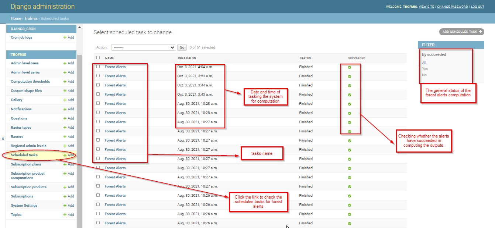
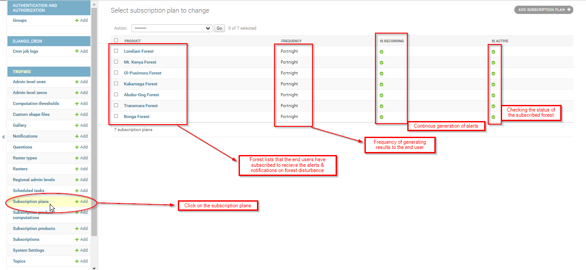

.. figure:: ../_static/Images/trofmis3.png

***************************************************
Maintaining Forest Disturbance - Radar Product
***************************************************
Forest Disturbance, computed using Radar Sentinel 2 images generates two products that are enlisted in the system.
They include both the **Forest Disturbance** and **Forest Surveilance Products.**
Both of these products are computed using the same methodology and scripts, however, for forest disturbance, the product is computed on the fly, and the products are 
visualised to te user through the system.
The Forest Surveilance, just as the name suggests, is subscribed for in the system, and the user automatically receives alerts and notification. These notifications are
considered when there is a forest disturbance which is more than 0.5 hectares.

Maintenace of these products is different in django admin, as there is no raster to be uploaded in the system.
However, there are some aspect to maintain for a succeful TroFMIS functionality. 

Forest Alerts - Scheduled tasks
***************************************************
This section outlines all the running tasks for forest alerts, that the users have tasked the system to compute. They will be listed as illustrated in the django admin 
below.
 

Forest Alerts - Subscription Plan
***************************************************
This section lists all the forest that have been suscribed by the users, and are either active or inactive. It also lists the plans that are available, including the period of computation of the alerts as illustrated below.

.. toctree::
   :maxdepth: 3
