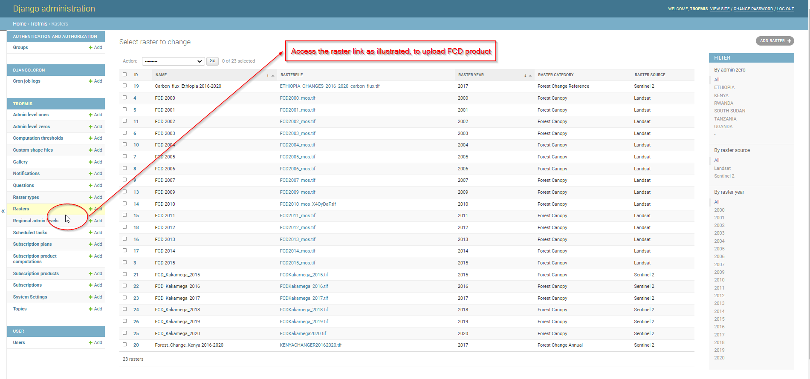
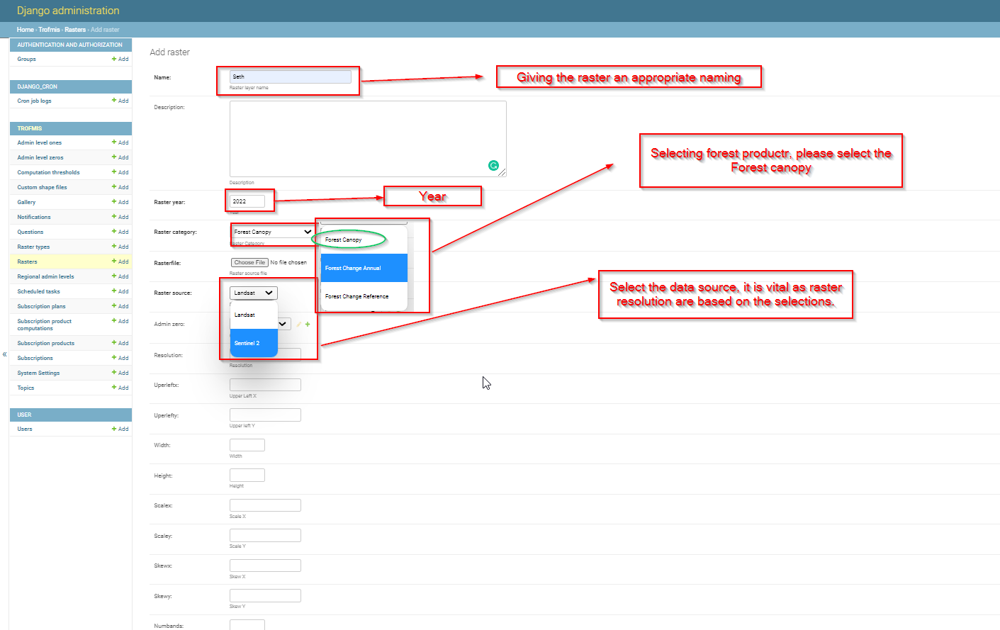

.. figure:: ../_static/Images/trofmis3.png

***************************************************
Updating Forest Canopy Density Product
***************************************************

Forest Canopy Density (FCD) is an annual product, and will require upodating every begining of the year, in order for the 
end users to access the product for the ended year.

 To update the FCD product in the system, please upload the product to djangio admin following the steps discussed below.
 Access the **raster** link as illustrated below.
 

    
Select and populate the expected section in the form for appropriate saving of FCD product as shown illustrated below.    

.. note:: 
Addition of description is not mandatory for uploading the FCD layers, however, it could be relevant when doing revision on the method and route of generating the products.
   

Remember to save the process after compeletion

.. figure:: ../_static/Images/savefcd.png
 
 
 
 

  
.. figure:: ../_static/Images/trofmis3.png
   

.. toctree::
   :maxdepth: 3
