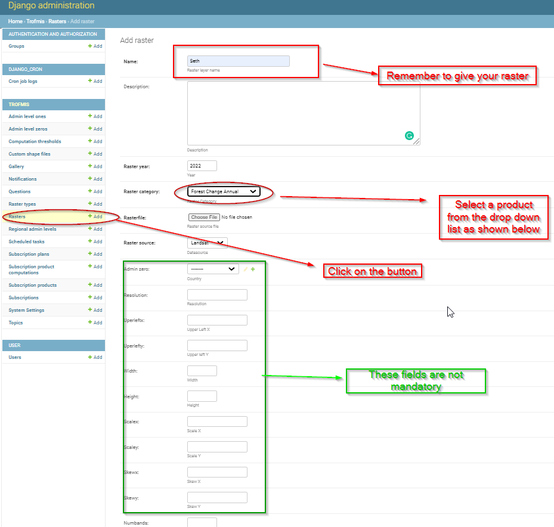
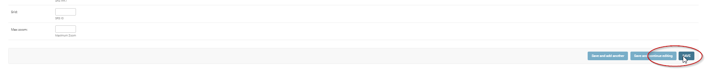

.. figure:: ../_static/Images/trofmis3.png

***************************************************
Updating Forest Canopy Change (FCC)
***************************************************
Forest Canopy change product are subdivided into two, namely the **Reference** and the **Annual** products.
For the end users to visualise the products in TroFMIS, they products require annual updating just as Forest Canopy Products.
To update and upload the products, please follow the steps as illustrated below.

Updating Annual and Refernce Products
***************************************************
Please reach out to the Raster link as illustrated below

   
Please remember to save the files after upload

Repeat the process for updating and uploading the Reference product in django admin.

.. figure:: ../_static/Images/trofmis3.png

.. toctree::
   :maxdepth: 3
