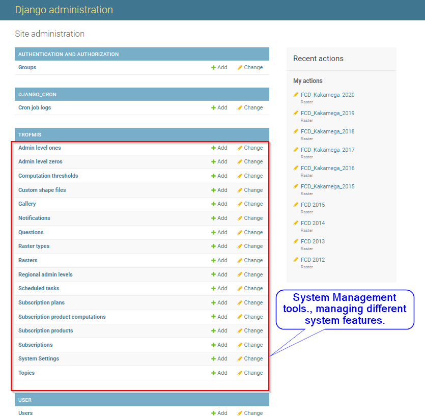
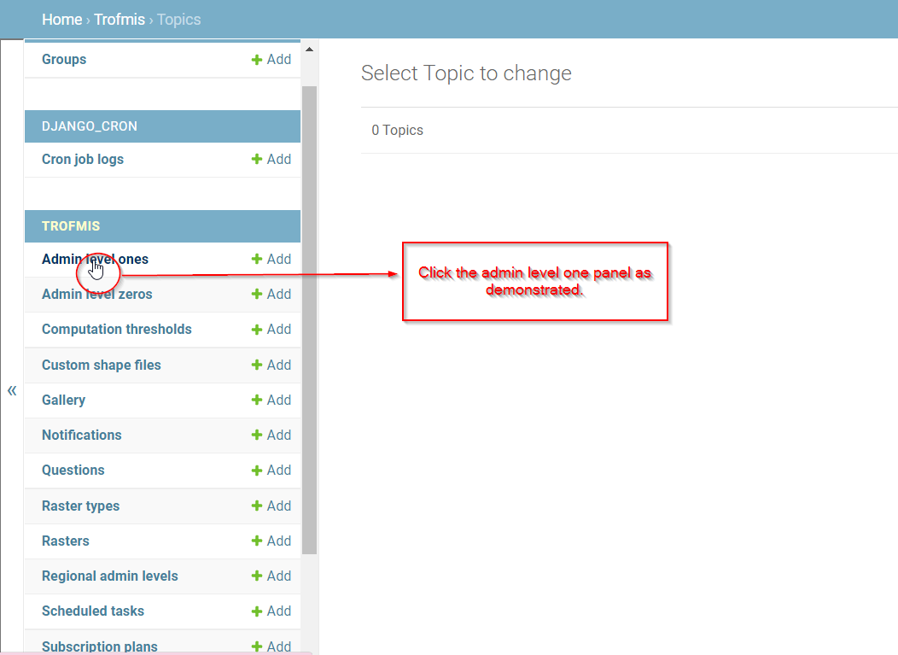
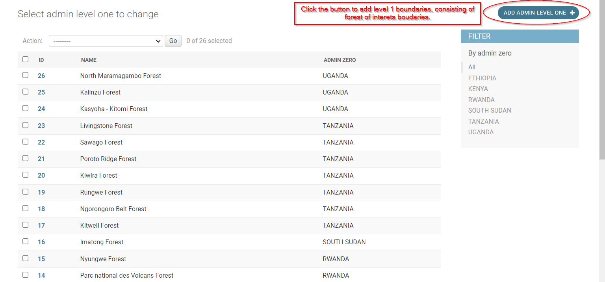
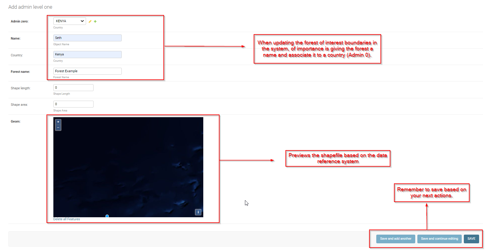

.. figure:: ../_static/Images/trofmis3.png

***************************************************
Django Site Administration Guide
***************************************************
The following document is a system administrators manual that gives information on how to configure and manage
the TroFMIS. 
The backend of the system is built on django framework and therefore features the general characteristics of Django admin settings. From the admin panel, the system administrators can manage dataset, users, and system resources,
thus ensuring that the computing resources are well utilized while still maintaining a high level of data security and
integrity. 
The figure below shows the django admin home page, when logged in. To log in to the Django admin framewok, please use the 
authorised TroFMIS email and password that were provided.

  

The components of the django admin are described in details in the next sections.

***************************************************
TroFMIS Models
***************************************************
Managing Administartive Boundaries
====================================
TroFNMIS has both the level 0 (Country) and level 1 boundary (Forest boundaries).
For the system continuity, the administrative boundaries will require updating. 
The system admin needs to upload the admin boundaries in shapefile format, incase of any update and system advancement.

To update the **admin level 1** click the django link as shown in the figure below.

The link leads to a panel that allows the admin to add the level 1 boundaries, of a specific forest as shown in the figure below.

When loading the admin level 1 boundary, remebner to follow the steps as shown in the figure below.
The mandatory steps include:
**Giving the admin boundary a name**, 
**Associate the boundary with country of origin**, 
**Save the file based on the next actions**.

   

  

  
.. figure:: ../_static/Images/trofmis3.png
    

.. toctree::
   :maxdepth: 3
